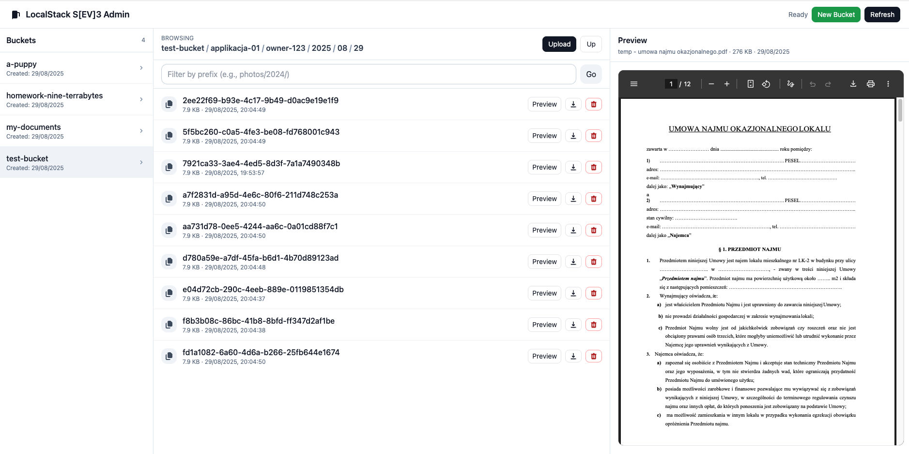

# LocalStack S3 — Admin Panel

This app provides a **lightweight admin panel** for managing S3 buckets and objects running on LocalStack.  
It consists of two parts:

- a **backend API** (Node.js + Express) that proxies requests to LocalStack’s S3 service, and
- a **frontend UI** (`index.html`) that consumes the API.

With it, you can create and delete buckets, browse objects, upload/download files, generate presigned URLs, and preview common file types directly in the browser — all without touching AWS.  
It’s ideal for local development, testing, or demos where you want the S3 experience but fully offline.

---

## What you get

- **Backend API** (Express + AWS SDK v3) on `http://localhost:4000`
- **Single-file UI** (`index.html`) that talks to the API
- **LocalStack** S3 via `docker-compose.yml`

---

## Install Node.js (if you don’t have it)

You’ll need **Node.js 22+ (LTS recommended, 24 or 18 works too)**.

### macOS / Linux (using nvm)

```bash
# install nvm if you don’t have it
curl -fsSL https://raw.githubusercontent.com/nvm-sh/nvm/master/install.sh | bash

# install Node.js 22 LTS
nvm install 22
nvm use 22
```

## Running the app

1 - run localstack if you don't have one running. Do it with Docker Compose by running cmd `docker compose up -d` from the project root.

2 - install all Node.js dependencies by running command `npm install express cors dotenv multer @aws-sdk/client-s3 @aws-sdk/s3-request-presigner` from the project root

3 - start the express server by running cmd `npm start` from the project root

4 - start `index.html` file ... from the project root

## Just Admin Panel img ... for flexing

If your bucket uses a directory-like structure, you can navigate through it


